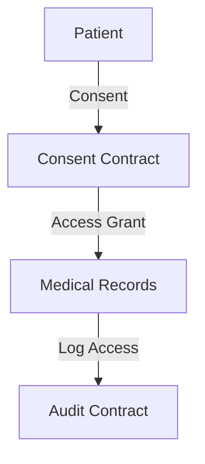

# 🌟 Stellar Uzima - Decentralized Medical Records on Stellar

Stellar Uzima is a decentralized smart contract system for secure, encrypted, and role-based management of medical records on the Stellar blockchain using Soroban and Rust. The project enables healthcare providers and patients to maintain control over sensitive medical data while ensuring privacy, immutability, and auditability. Built specifically for healthcare organizations transitioning to blockchain-based record keeping, the system also respects traditional healing practices by supporting metadata for indigenous medical records.

The platform provides a comprehensive solution for modern healthcare data management, combining the security benefits of blockchain technology with practical healthcare workflows. It's designed for hospitals, clinics, research institutions, and healthcare providers who need to maintain patient confidentiality while enabling secure data sharing between authorized parties.

---

## 📋 Table of Contents

- [Project Overview](#project-overview)
- [Setup Instructions](#setup-instructions)
  - [Prerequisites](#prerequisites)
  - [Quick Start](#quick-start)
  - [Environment Setup](#environment-setup)
  - [Running Tests](#running-tests)
  - [Network Configuration](#network-configuration)
- [Features](#features)
- [Architecture](#architecture)
- [Visual Documentation](#visual-documentation)
- [Project Structure](#project-structure)
- [Usage Examples](#usage-examples)
- [Deployment](#deployment)
- [Developer Guide](#developer-guide)
- [CLI Guide](#cli-guide)
- [Helpful Links](#helpful-links)
- [Contribution Guidelines](#contribution-guidelines)
- [Contract Review Checklist](#contract-review-checklist)
- [Troubleshooting](#troubleshooting)
- [FAQ](#frequently-asked-questions-faq)
- [License](#license)

---

## 🎯 Project Overview

Stellar Uzima transforms medical record management by leveraging Stellar's blockchain infrastructure to create an immutable, secure, and patient-centric healthcare data ecosystem. The system addresses critical healthcare challenges including data breaches, interoperability issues, and patient privacy concerns through cryptographic security and decentralized governance.

**Key Benefits:**
- **Enhanced Security**: Military-grade encryption protects sensitive medical data
- **Patient Control**: Patients grant and revoke access to their records
- **Interoperability**: Standardized format enables seamless data exchange
- **Audit Trail**: Complete, immutable history of all record access and modifications
- **Cultural Respect**: Support for traditional healing practices and metadata

**Target Users:**
- Healthcare providers and hospitals
- Medical research institutions
- Health insurance companies
- Patients seeking control over their medical data
- Traditional medicine practitioners

## 🔧 Contract Optimization Engine

The project includes an advanced **Contract Optimization Recommendations Engine** that analyzes smart contracts and provides actionable recommendations for:

- **Gas Optimization**: Reduce transaction costs through efficient code patterns
- **Storage Efficiency**: Optimize data storage and access patterns
- **Algorithm Optimization**: Improve computational efficiency
- **Batching Opportunities**: Group operations to minimize overhead
- **Parallelization Possibilities**: Identify opportunities for concurrent execution

The engine integrates with CI/CD pipelines to automatically review pull requests and track recommendation accuracy over time.

---

## 🚀 Setup Instructions

### ✅ Prerequisites

Before you begin, ensure you have the following installed:

- **Rust 1.78.0+** - [Install Rust](https://www.rust-lang.org/tools/install)
- **Soroban CLI v21.7.7+** - [Install Soroban](https://soroban.stellar.org/docs/getting-started/installation)
- **Git** - For version control
- **Make** - For using the provided Makefile (optional but recommended)

### ⚡ Quick Start

Get up and running in under 5 minutes:

```bash
# Clone the repository
git clone https://github.com/your-org/Uzima-Contracts.git
cd Uzima-Contracts

# Run the automated setup script
chmod +x setup.sh
./setup.sh

# Or use the Makefile for step-by-step setup
make setup
```

### 🔧 Environment Setup

#### Option 1: Automated Setup (Recommended)

The `setup.sh` script handles everything automatically:

```bash
./setup.sh
```

This script will:
- Install Rust 1.78.0 and required targets
- Install Soroban CLI v21.7.7
- Set up project structure
- Configure Soroban networks (local, testnet, futurenet)
- Build the project and run tests
- Generate default identity

#### Option 2: Manual Setup

```bash
# Install Rust targets and components
rustup target add wasm32-unknown-unknown
rustup component add rustfmt clippy rust-src

# Install Soroban CLI
cargo install --locked --version 21.7.7 soroban-cli

# Configure Soroban
soroban config identity generate default
soroban config network add local \
  --rpc-url http://localhost:8000/soroban/rpc \
  --network-passphrase "Standalone Network ; February 2017"

# Build the project
cargo build --all-targets

# Run tests to verify setup
cargo test --all
```

### 🧪 Running Tests

Ensure everything is working correctly:

```bash
# Run all tests
make test

# Or use cargo directly
cargo test --all

# Run specific test types
make test-unit          # Unit tests only
make test-integration   # Integration tests only

# Test the optimization engine
./scripts/test_optimizer.sh

# Run optimization analysis
make optimize

# Generate optimization report
make analyze-optimizations

# View optimization metrics
make optimization-metrics
```

### 🌐 Network Configuration

The project supports multiple Stellar networks:

```bash
# Start local development network
make start-local
# or
soroban network start local

# Deploy to local network
make deploy-local

# Stop local network
make stop-local
```

**Available Networks:**
- **Local**: `http://localhost:8000/soroban/rpc` (Development)
- **Testnet**: `https://soroban-testnet.stellar.org:443` (Testing)
- **Futurenet**: `https://rpc-futurenet.stellar.org:443` (Staging)

---

## Visual Documentation

### Comprehensive System Diagrams

We've created extensive visual documentation using Mermaid.js to help you understand the complex interactions between contracts and system components.

#### **Key Diagrams Available:**

1. **[System Architecture Overview](docs/SYSTEM_ARCHITECTURE.md)** - Complete system architecture with all contracts and their interactions
2. **[Payment Flow Diagrams](docs/PAYMENT_FLOW_DIAGRAMS.md)** - Healthcare payment processing, escrow, and settlement flows
3. **[Identity Verification Flow](docs/IDENTITY_VERIFICATION_FLOW.md)** - W3C DID-based identity management and verification
4. **[Cross-Chain Interaction Flow](docs/CROSS_CHAIN_INTERACTION_FLOW.md)** - Multi-chain data synchronization and access patterns
5. **[Data Access Patterns](docs/DATA_ACCESS_PATTERNS.md)** - Secure data access control and privacy protection flows

#### **Quick Example:**


#### **Viewing Diagrams:**
- **GitHub**: Automatic rendering in README files
- **VS Code**: Install "Markdown Preview Mermaid Support" extension
- **Web**: Add Mermaid.js to your HTML pages
- **Documentation**: See [docs/DIAGRAMS_INDEX.md](docs/DIAGRAMS_INDEX.md) for complete guide

These diagrams provide essential context for understanding:
- How contracts interact with each other
- Data flow and access patterns
- Cross-chain synchronization processes
- Payment and settlement mechanisms
- Identity verification workflows

---

## Features

### Key Features

- Encrypted on-chain medical records storage
- Role-based access control (patients, doctors, admins)
- Immutable timestamping and full history tracking
- Integration of traditional healing metadata
- Public key-based identity verification
- Fully testable, modular, and CI-enabled
- Gas-efficient contract design
- Decentralized governance with Governor + Timelock (proposals, voting, queued execution)
- Upgrade-safe deprecation tracking for legacy contract entrypoints with warning events and migration guides

---

## CLI Guide

See [docs/CLI_GUIDE.md](docs/CLI_GUIDE.md) for advanced transaction management commands and examples.

---

## 🏗️ Project Structure

```
Uzima-Contracts/
│
├── contracts/
│   └── medical_records/
│       ├── src/
│       │   └── lib.rs         # Main contract logic
│       └── Cargo.toml         # Contract dependencies
│
├── scripts/                   # Deployment and interaction scripts
│   ├── deploy.sh             # Contract deployment
│   ├── interact.sh           # Contract interaction
│   └── test_scripts/         # Test utilities
│
├── tests/
│   ├── integration/          # Integration tests
│   └── unit/                 # Unit tests
│
├── docs/                     # Documentation
│   ├── api.md               # API reference
│   └── architecture.md      # Architecture details
│
├── .github/
│   └── workflows/
│       └── ci.yml            # Continuous integration
│
├── setup.sh                  # Automated setup script
├── makefile                  # Build automation
├── dockerfile               # Docker support
├── Cargo.toml               # Workspace configuration
└── README.md                # This file
```

---

## � Usage Examples

### Basic Contract Interaction

```bash
# Deploy the medical records contract
./scripts/deploy.sh medical_records local

# Initialize the contract with admin
./scripts/interact.sh <CONTRACT_ID> local initialize

# Register a new patient
./scripts/interact.sh <CONTRACT_ID> local register_patient \
  --patient-id "P12345" \
  --public-key "GD5..."

# Add a medical record
./scripts/interact.sh <CONTRACT_ID> local write_record \
  --patient-id "P12345" \
  --doctor-id "D67890" \
  --encrypted-data "QmXxx..." \
  --metadata "traditional_healing"
```

### Using the Makefile

```bash
# Complete development workflow
make dev-deploy

# Individual steps
make build           # Build contracts
make test            # Run tests
make start-local     # Start local network
make deploy-local    # Deploy contracts
```

---

## 🚀 Deployment

### Local Development

```bash
# Quick deployment to local network
make dev-deploy

# Step-by-step deployment
make clean
make build-opt
make dist
make start-local
make deploy-local
```

### Testnet Deployment

```bash
# Configure testnet (if not already configured)
soroban config network add testnet \
  --rpc-url https://soroban-testnet.stellar.org:443 \
  --network-passphrase "Test SDF Network ; September 2015"

# Build for deployment
make build-opt

# Deploy to testnet
./scripts/deploy.sh medical_records testnet
```

### Production Deployment

For production deployment on Stellar Mainnet:

1. Ensure you have sufficient XLM for deployment
2. Configure mainnet network settings
3. Use optimized builds: `make build-opt`
4. Consider using the provided Dockerfile for consistent builds

```bash
# Build production Docker image
docker build -t uzima-contracts .

# Deploy using Docker
docker run -it --rm -v $(PWD):/workspace uzima-contracts \
  make build-opt deploy-mainnet
```

---

## 🔄 CI/CD Pipeline

The project includes a comprehensive CI/CD pipeline for automated testing, building, security scanning, and deployment.

### GitHub Actions Workflows

#### Continuous Integration (CI)

The CI workflow (`.github/workflows/ci.yml`) runs on every push and pull request:

- **Code Formatting**: Checks code formatting with `cargo fmt`
- **Linting**: Runs Clippy with strict warnings
- **Unit Tests**: Executes all unit tests
- **Integration Tests**: Runs integration tests with Soroban CLI
- **Build**: Builds optimized WASM contracts
- **Shell Script Linting**: Validates shell scripts with ShellCheck

```bash
# View CI status
# Check the "Actions" tab on GitHub or:
gh workflow view ci.yml
```

#### Security Scanning

The security workflow (`.github/workflows/security.yml`) performs automated security checks:

- **Dependency Audit**: Scans for known vulnerabilities with `cargo-audit`
- **Security-focused Clippy**: Checks for security anti-patterns
- **Secret Scanning**: Detects hardcoded secrets with Gitleaks
- **Dependency Review**: Reviews dependency changes in PRs

Runs on:
- Every push to main/develop branches
- Pull requests
- Daily at 2 AM UTC (scheduled)

#### Automated Testnet Deployment

The deployment workflow (`.github/workflows/deploy-testnet.yml`) automatically deploys to testnet:

**Triggers:**
- Pushes to `develop` branch
- Version tags (e.g., `v1.0.0`)
- Manual workflow dispatch

**Process:**
1. Runs pre-deployment tests (unless skipped)
2. Builds optimized contracts
3. Deploys to testnet
4. Verifies deployments
5. Creates deployment summary

**Configuration:**

Set up the following GitHub secrets:
- `TESTNET_DEPLOYER_SECRET_KEY`: Secret key for testnet deployment account

```bash
# Manual deployment via GitHub Actions
gh workflow run deploy-testnet.yml \
  --field contract=medical_records \
  --field skip_tests=false
```

### Deployment Scripts

#### Enhanced Deployment with Rollback

Deploy contracts with automatic backup and rollback support:

```bash
# Deploy with rollback enabled (default)
./scripts/deploy_with_rollback.sh medical_records testnet

# Deploy without rollback
./scripts/deploy_with_rollback.sh medical_records testnet default --no-rollback
```

**Features:**
- Automatic backup of current deployment
- Rollback on deployment failure
- Contract verification after deployment
- Deployment metadata tracking

#### Environment-based Deployment

Deploy all contracts to a specific environment:

```bash
# Deploy all contracts to testnet
./scripts/deploy_environment.sh testnet

# Deploy specific contracts
./scripts/deploy_environment.sh testnet --contracts medical_records,identity_registry

# Skip tests (not recommended)
./scripts/deploy_environment.sh testnet --skip-tests
```

**Environments:**
- `local`: Local development network
- `testnet`: Stellar testnet
- `futurenet`: Stellar futurenet (staging)
- `mainnet`: Production mainnet (requires confirmation)

#### Deployment Monitoring

Monitor deployed contracts and receive alerts:

```bash
# Monitor all deployments on testnet
./scripts/monitor_deployments.sh testnet

# Monitor with alerts on failure
./scripts/monitor_deployments.sh testnet --alert-on-failure
```

**Features:**
- Health checks for all deployed contracts
- Contract verification
- Alert generation for unhealthy contracts
- Deployment status reporting

#### Rollback Deployment

Rollback a contract to a previous version:

```bash
# Interactive rollback (selects latest backup)
./scripts/rollback_deployment.sh medical_records testnet

# Rollback to specific backup
./scripts/rollback_deployment.sh medical_records testnet \
  deployments/testnet_medical_records_backup_20240101_120000.json
```

**Process:**
1. Lists available backups
2. Verifies backup contract exists
3. Restores deployment configuration
4. Logs rollback action

#### Deployment Status

View deployment status across all networks:

```bash
# Show all deployments
./scripts/deployment_status.sh

# Show deployments for specific network
./scripts/deployment_status.sh testnet
```

**Information displayed:**
- Contract names and IDs
- Deployment timestamps
- Rollback status
- Backup availability
- Rollback history

### Deployment Workflow

#### Standard Deployment Process

1. **Development**: Make changes and test locally
   ```bash
   make test
   make build-opt
   ```

2. **CI Validation**: Push to branch triggers CI
   - Tests run automatically
   - Security scans execute
   - Build artifacts created

3. **Testnet Deployment**: Merge to `develop` triggers testnet deployment
   - Contracts deployed automatically
   - Verification runs
   - Status reported

4. **Production Deployment**: Manual deployment to mainnet
   ```bash
   ./scripts/deploy_environment.sh mainnet
   ```

#### Rollback Process

If a deployment fails or issues are detected:

1. **Identify Issue**: Check deployment logs and monitoring
   ```bash
   ./scripts/monitor_deployments.sh testnet
   ```

2. **Review Backups**: List available backups
   ```bash
   ./scripts/rollback_deployment.sh medical_records testnet
   ```

3. **Execute Rollback**: Restore previous version
   ```bash
   ./scripts/rollback_deployment.sh medical_records testnet <backup_file>
   ```

4. **Verify**: Confirm rollback success
   ```bash
   ./scripts/monitor_deployments.sh testnet
   ```

### Deployment Artifacts

Deployment information is stored in the `deployments/` directory:

```
deployments/
├── testnet_medical_records.json          # Current deployment
├── testnet_medical_records_backup_*.json # Backup files
├── rollback_log.json                     # Rollback history
└── alerts.log                            # Alert log
```

**Deployment File Format:**
```json
{
  "contract_name": "medical_records",
  "contract_id": "C...",
  "network": "testnet",
  "deployer": "deployer-testnet",
  "deployed_at": "2025-01-15T10:30:00Z",
  "wasm_hash": "...",
  "commit_sha": "..."
}
```

### CI/CD Best Practices

1. **Always run tests locally** before pushing
2. **Review CI results** before merging PRs
3. **Monitor deployments** after each release
4. **Keep backups** for critical deployments
5. **Use rollback** when issues are detected
6. **Document** any manual deployment steps

### Troubleshooting

#### CI Failures

- **Formatting errors**: Run `cargo fmt --all`
- **Clippy warnings**: Fix warnings or add `#[allow(...)]` with justification
- **Test failures**: Review test output and fix issues
- **Build failures**: Check Rust version and dependencies

#### Deployment Failures

- **Network issues**: Verify network connectivity and RPC endpoints
- **Insufficient funds**: Fund deployment account
- **Contract errors**: Check contract logs and verify WASM file
- **Identity issues**: Ensure identity is properly configured

#### Rollback Issues

- **No backups**: Previous deployments weren't backed up
- **Invalid backup**: Backup file may be corrupted
- **Contract not found**: Backup contract may have been removed

For more help, check the [GitHub Issues](https://github.com/your-org/Uzima-Contracts/issues) or [Discussions](https://github.com/your-org/Uzima-Contracts/discussions).

---

## 🔗 Helpful Links

### Documentation
- [API Reference](./docs/api.md) - Complete contract API documentation and stability guarantees
- [Architecture Guide](./docs/architecture.md) - System design and patterns
- [Type Safety Guidelines](./docs/TYPE_SAFETY_GUIDELINES.md) - Best practices for Soroban type safety
- [Contract Resource Limits](./docs/CONTRACT_RESOURCE_LIMITS.md) - Storage, execution, and batch constraints for all contracts
- [Soroban Documentation](https://soroban.stellar.org/docs) - Official Soroban docs
- [Stellar Developer Portal](https://developers.stellar.org/) - Stellar ecosystem

### Repository Resources
- [Contracts](./contracts/) - Smart contract source code
- [Scripts](./scripts/) - Deployment and utility scripts
- [Tests](./tests/) - Test suites and examples
- [CI/CD](./.github/workflows/) - GitHub Actions workflows

### External Resources
- [Stellar Laboratory](https://laboratory.stellar.org/) - Transaction builder and explorer
- [Stellar Expert](https://stellar.expert/) - Blockchain explorer
- [Rust Documentation](https://doc.rust-lang.org/) - Rust language reference

---

## 🤝 Contribution Guidelines

We welcome contributions from the community! Please follow these guidelines to ensure smooth collaboration.

### Getting Started

1. **Fork the repository** on GitHub
2. **Clone your fork** locally:
   ```bash
   git clone https://github.com/your-username/Uzima-Contracts.git
   cd Uzima-Contracts
   ```
3. **Add upstream remote**:
   ```bash
   git remote add upstream https://github.com/original-org/Uzima-Contracts.git
   ```

### Development Workflow

1. **Create a feature branch**:
   ```bash
   git checkout -b feature/your-feature-name
   ```

2. **Make your changes** following our coding standards:
   - Use `cargo fmt` for formatting
   - Run `cargo clippy` for linting
   - Ensure all tests pass: `cargo test`

3. **Review the contract review checklist** in [docs/contract-review-checklist.md](docs/contract-review-checklist.md)

4. **Test thoroughly**:
   ```bash
   make test          # Run all tests
   make check         # Run formatting, linting, and tests
   ```

4. **Commit your changes**:
   ```bash
   git commit -m "feat: add your feature description"
   ```

5. **Push to your fork**:
   ```bash
   git push origin feature/your-feature-name
   ```

6. **Create a Pull Request** with:
   - Clear description of changes
   - Links to relevant issues
   - Test results
   - Documentation updates (if applicable)

### Code Standards

- **Rust**: Follow official Rust style guidelines
- **Documentation**: Include doc comments for all public functions
- **Tests**: Maintain >80% code coverage
- **Commits**: Use [Conventional Commits](https://www.conventionalcommits.org/) format

### Review Process

All PRs undergo:
1. **Automated checks** (CI/CD pipeline)
2. **Code review** by maintainers
3. **Integration testing** on testnet
4. **Security audit** for significant changes

## Contract Review Checklist
Review contract submissions using the shared checklist at [docs/contract-review-checklist.md](docs/contract-review-checklist.md).

### Definition of Done

A contribution is complete when:
- ✅ All tests pass (`cargo test`)
- ✅ Code is formatted (`cargo fmt`)
- ✅ No linting warnings (`cargo clippy`)
- ✅ Documentation is updated
- ✅ CI/CD pipeline passes
- ✅ Security review completed (if applicable)

---

## 📄 License

This project is licensed under the MIT License - see the [LICENSE](LICENSE) file for details.

**Copyright © 2025 Stellar Uzima Contributors**

---

## 🔧 Troubleshooting

### Common Issues and Solutions

#### Setup Issues

**Problem**: Rust installation fails
```bash
# Solution: Use rustup installer
curl --proto '=https' --tlsv1.2 -sSf https://sh.rustup.rs | sh
source ~/.cargo/env
```

**Problem**: Soroban CLI not found
```bash
# Solution: Install with specific version
cargo install --locked --version 21.7.7 soroban-cli
```

**Problem**: Permission denied on setup.sh
```bash
# Solution: Make script executable
chmod +x setup.sh
./setup.sh
```

#### Build Issues

**Problem**: WASM target not found
```bash
# Solution: Add WASM target
rustup target add wasm32-unknown-unknown
```

**Problem**: Contract compilation fails
```bash
# Solution: Clean and rebuild
make clean
make build
```

#### Network Issues

**Problem**: Local network won't start
```bash
# Solution: Check if port is in use
netstat -tulpn | grep :8000
# Kill existing process if needed
sudo kill -9 <PID>
# Restart network
make start-local
```

**Problem**: Testnet deployment fails
```bash
# Solution: Check account balance
soroban config account show
# Fund account if needed
# (Use Stellar Laboratory or friendbot on testnet)
```

#### Contract Issues

**Problem**: Contract not found after deployment
```bash
# Solution: Verify contract exists
soroban contract invoke --id <CONTRACT_ID> --network testnet \
  --wasm target/wasm32-unknown-unknown/release/<CONTRACT_NAME>.wasm \
  -- function_name="get_version"
```

**Problem**: Transaction timeout
```bash
# Solution: Increase timeout or use local network
soroban contract invoke --id <CONTRACT_ID> --network local \
  --timeout 300 \
  -- function_name="your_function"
```

### Getting Help

If you encounter issues not covered here:

1. **Check the logs**: Look at the full error output
2. **Search existing issues**: Check [GitHub Issues](https://github.com/Stellar-Uzima/Uzima-Contracts/issues)
3. **Ask for help**: Start a [GitHub Discussion](https://github.com/Stellar-Uzima/Uzima-Contracts/discussions)
4. **Join our community**: Connect with other developers

---

## ❓ Frequently Asked Questions (FAQ)

### General Questions

**Q: What is Stellar Uzima?**
A: Stellar Uzima is a decentralized medical records system built on the Stellar blockchain that enables secure, patient-controlled healthcare data management.

**Q: Why use blockchain for medical records?**
A: Blockchain provides immutability, security, audit trails, and patient control over data access - all critical for healthcare data.

**Q: Is this HIPAA compliant?**
A: The system is designed with privacy and security principles that align with HIPAA requirements, but compliance depends on implementation and usage.

### Technical Questions

**Q: What programming languages are used?**
A: Smart contracts are written in Rust using the Soroban framework. The project also includes shell scripts for deployment and automation.

**Q: Can I run this on my own infrastructure?**
A: Yes, you can deploy to your own Stellar node or use the public testnet/mainnet networks.

**Q: How are medical records encrypted?**
A: Records are encrypted using public key cryptography before being stored on-chain. Only authorized parties with the correct keys can decrypt the data.

**Q: What about traditional medicine?**
A: The system includes metadata fields specifically designed to support traditional healing practices and indigenous medical knowledge.

### Development Questions

**Q: How do I contribute?**
A: See the [Contribution Guidelines](#contribution-guidelines) section. We welcome bug reports, feature requests, and code contributions.

**Q: What's the best way to test changes?**
A: Use the local development network for testing: `make start-local && make deploy-local`

**Q: Are there any gas fees?**
A: Yes, Stellar transactions require small fees in XLM, but they are significantly lower than other blockchain platforms.

### Deployment Questions

**Q: Can I deploy to mainnet?**
A: Yes, but ensure thorough testing on testnet first. Mainnet deployment involves real costs and should be done carefully.

**Q: How do I handle contract upgrades?**
A: The system includes upgrade-safe deprecation tracking and migration guides for legacy contracts.

**Q: What about data privacy?**
A: All sensitive medical data is encrypted before storage, and access is controlled through patient consent mechanisms.

---

## 🆘 Support

- **Issues**: [GitHub Issues](https://github.com/your-org/Uzima-Contracts/issues)
- **Discussions**: [GitHub Discussions](https://github.com/your-org/Uzima-Contracts/discussions)
- **Documentation**: [Project Docs](./docs/)

---

*Built with ❤️ for the healthcare community*
