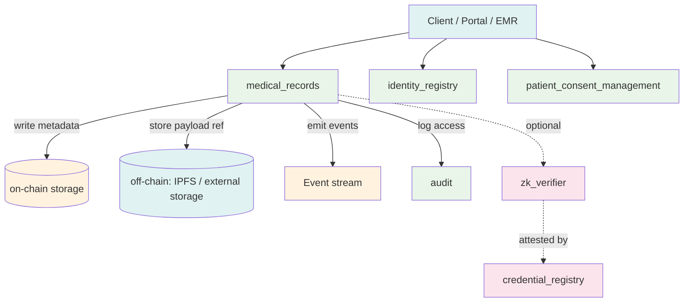
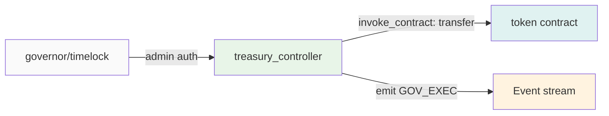
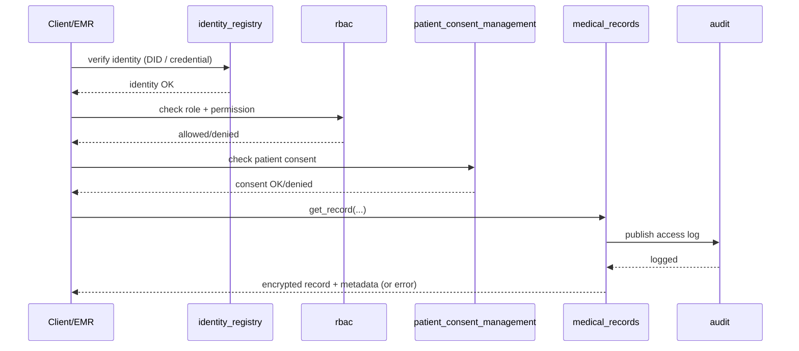
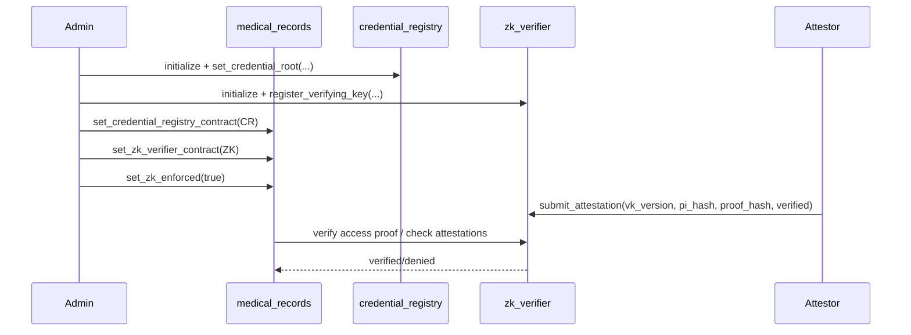
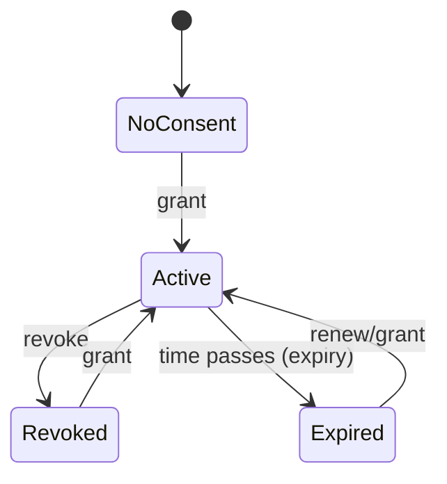
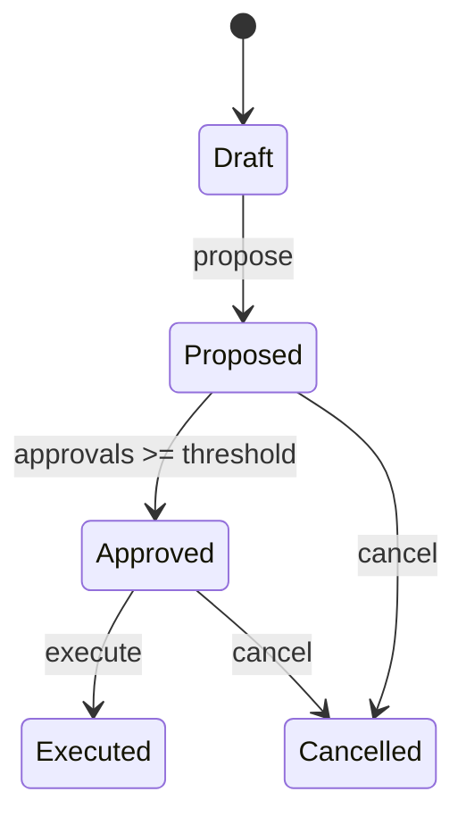
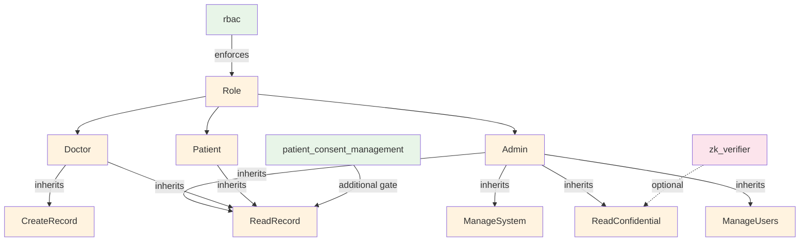
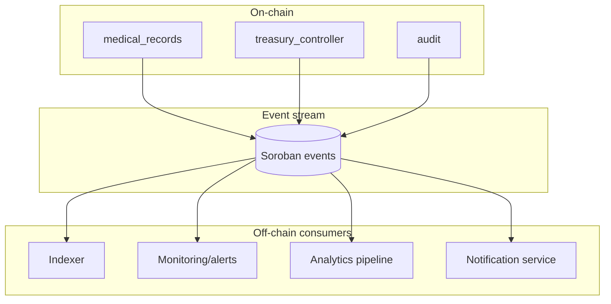

# Contract interaction diagrams

This document complements the existing visual docs by focusing specifically on **contract-to-contract interactions** and their **control/data flows**.

> All diagrams use Mermaid. See `docs/DIAGRAMS_INDEX.md` for rendering tips and standards.

## Major contracts (interaction-focused)

- **Core**: `medical_records`, `identity_registry`, `patient_consent_management`, `rbac`, `audit`
- **Security**: `mfa`, `credential_registry`, `zk_verifier`, `zkp_registry`
- **Governance/upgradeability**: `governor`, `timelock`, `upgrade_manager`
- **Payments/treasury**: `healthcare_payment`, `payment_router`, `escrow`, `appointment_booking_escrow`, `treasury_controller`
- **Cross-chain**: `cross_chain_bridge`, `cross_chain_access`, `cross_chain_identity`, `regional_node_manager`

## 1) Data flow diagrams

### Medical record write + audit + optional ZK gate

### Treasury governance execution (token transfer)

## 2) Call sequence diagrams

### Consent-gated record read (provider)

### ZK attestation gating (tests demonstrate multi-contract setup)

## 3) State machine diagrams

### Consent grant lifecycle (high level)

### Treasury proposal execution (conceptual)

## 4) Permission inheritance diagrams

## 5) Message flow diagrams

### Event emission and off-chain consumers

## Update process (how to keep diagrams correct)

When changing contract behavior or cross-contract wiring:

1. **Update code/tests first**
2. **Update diagrams** in `docs/CONTRACT_INTERACTIONS.md` and/or the specific subsystem doc
3. **Confirm diagram renders** locally (Mermaid preview)
4. **Link new diagrams** from `docs/DIAGRAMS_INDEX.md`
5. If you changed event topics/payloads, also run `npm run events:validate`

