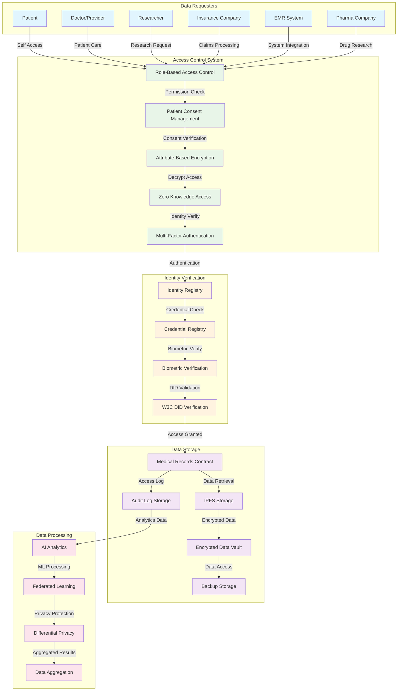
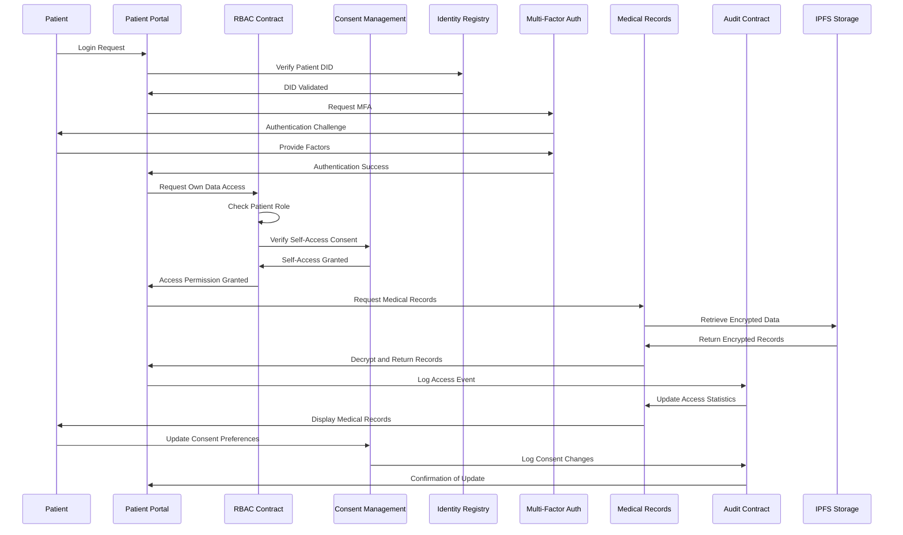
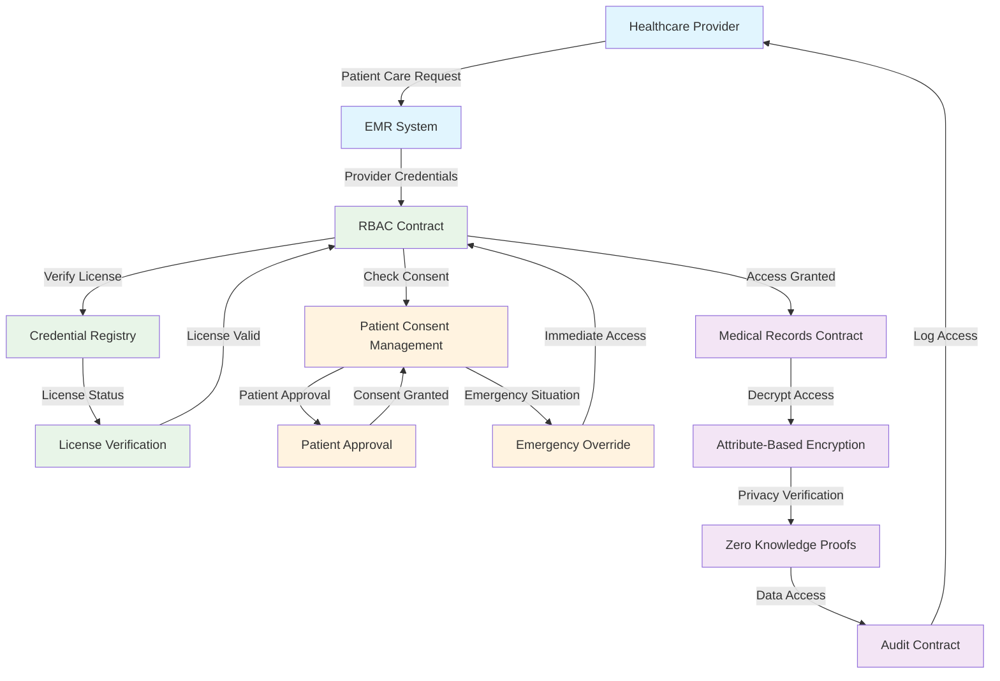
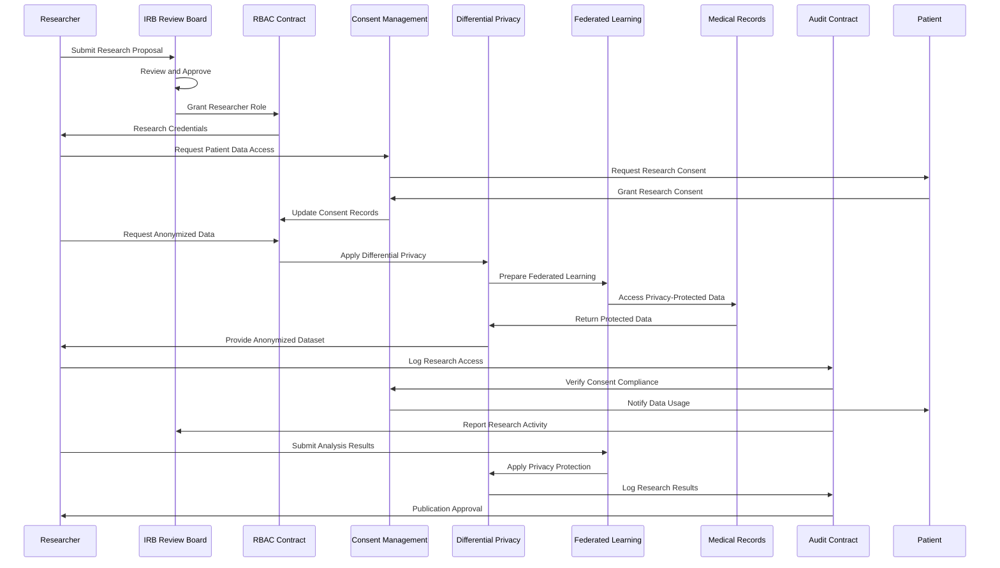
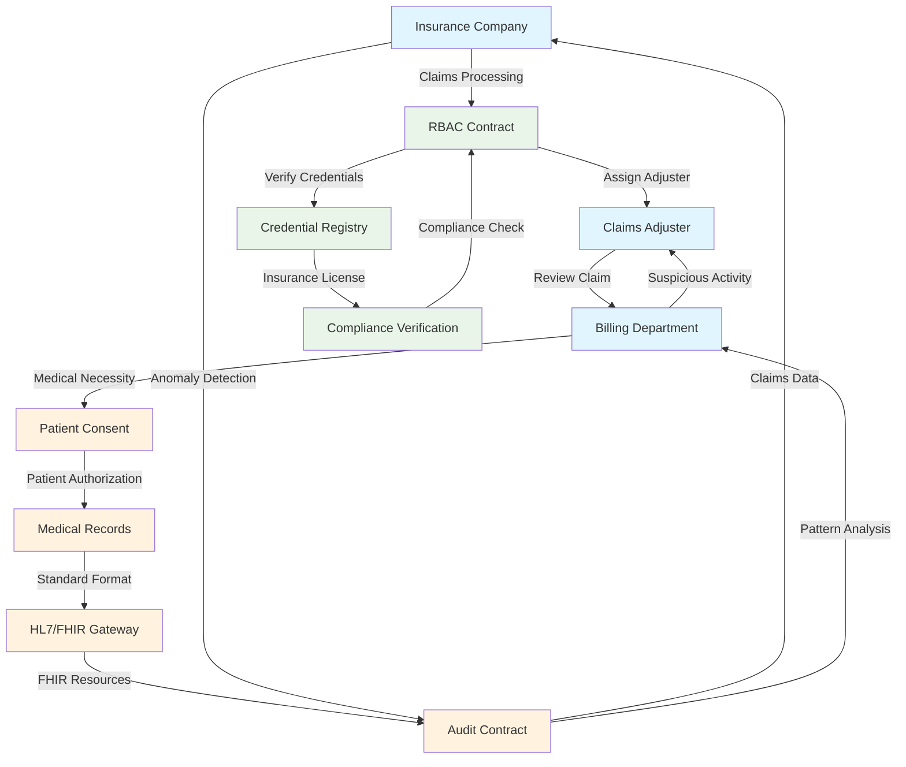
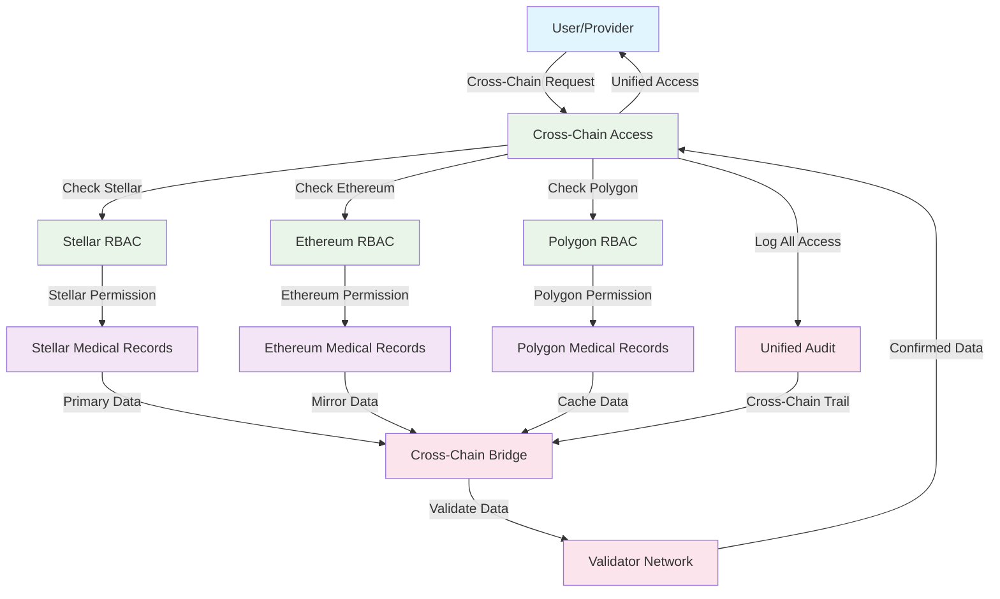
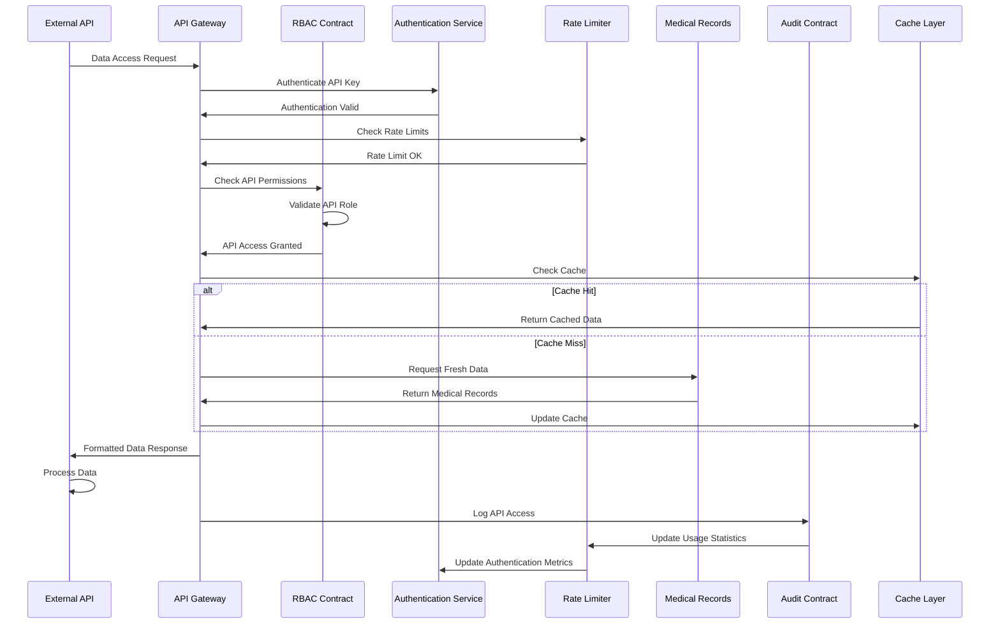
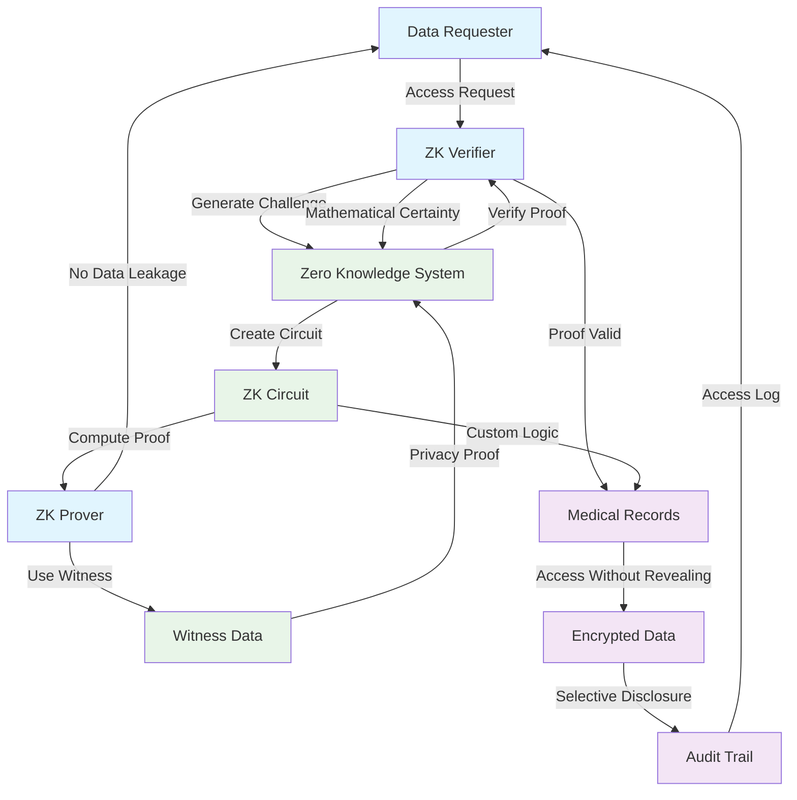

# Data Access Pattern Diagrams

## Healthcare Data Access Architecture



## Patient-Initiated Data Access Flow



## Provider-Initiated Data Access Flow



## Research Data Access with Privacy Protection



## Insurance Claims Data Access Pattern



## Emergency Access Override Pattern

```mermaid
sequenceDiagram
    participant EMERGENCY as Emergency Situation
    participant PROVIDER as Emergency Provider
    participant EAO as Emergency Access Override
    participant RBAC as RBAC Contract
    patient_consent_management as Patient Consent Management
    participant MR as Medical Records
    participant AUDIT as Audit Contract
    participant GOV as Governance Contract
    participant PATIENT as Patient (if available)

    %% Step 1: Emergency Declaration
    EMERGENCY->>PROVIDER: Medical Emergency
    PROVIDER->>EAO: Declare Emergency Access
    EAO->>GOV: Request Emergency Override
    GOV->>EAO: Emergency Override Granted

    %% Step 2: Bypass Normal Controls
    EAO->>RBAC: Override Access Controls
    RBAC->>patient_consent_management: Bypass Consent Check
    patient_consent_management->>EAO: Emergency Access Granted

    %% Step 3: Immediate Data Access
    EAO->>MR: Emergency Record Access
    MR->>EAO: Full Medical History
    EAO->>PROVIDER: Critical Patient Data

    %% Step 4: Emergency Treatment
    PROVIDER->>EMERGENCY: Provide Emergency Care
    EMERGENCY->>PROVIDER: Patient Stabilized

    %% Step 5: Post-Emergency Processing
    PROVIDER->>AUDIT: Log Emergency Access
    AUDIT->>GOV: Report Emergency Usage
    GOV->>PATIENT: Notify Emergency Access
    PATIENT->>patient_consent_management: Review Emergency Access

    %% Step 6: Audit and Review
    AUDIT->>EAO: Emergency Access Review
    EAO->>GOV: Justification Report
    GOV->>EAO: Emergency Access Validated
```

## Cross-Chain Data Access Pattern



## API-Based Data Access Pattern



## Data Access with Zero-Knowledge Proofs



## Key Data Access Patterns

### **1. Role-Based Access Control (RBAC)**
- **Hierarchical Permissions**: Doctor > Nurse > Admin > Patient
- **Scope Limitation**: Access only relevant medical records
- **Time-Based Access**: Temporary access for specific periods
- **Audit Trail**: Complete access logging

### **2. Consent-Driven Access**
- **Explicit Consent**: Patient must grant access
- **Granular Control**: Specific data type permissions
- **Revocation**: Dynamic consent withdrawal
- **Emergency Override**: Life-threatening situations

### **3. Privacy-Preserving Access**
- **Zero-Knowledge Proofs**: Verify without revealing data
- **Differential Privacy**: Statistical privacy protection
- **Data Anonymization**: Remove personal identifiers
- **Federated Learning**: Learn without data movement

### **4. Cross-Chain Access**
- **Unified Identity**: Single identity across chains
- **Permission Mapping**: Translate between chain permissions
- **Data Synchronization**: Consistent access across networks
- **Fallback Mechanisms**: Alternative access paths

### **5. Emergency Access**
- **Immediate Override**: Bypass normal controls
- **Time-Limited**: Temporary emergency access
- **Post-Review**: Audit after emergency
- **Multi-Party Approval**: Guardian-based verification

### **6. API-Based Access**
- **Rate Limiting**: Prevent abuse
- **Authentication**: Secure API key management
- **Caching**: Improve performance
- **Monitoring**: Real-time access tracking

These data access patterns provide a comprehensive, secure, and privacy-preserving framework for healthcare data access while maintaining regulatory compliance and patient control over their medical information.
