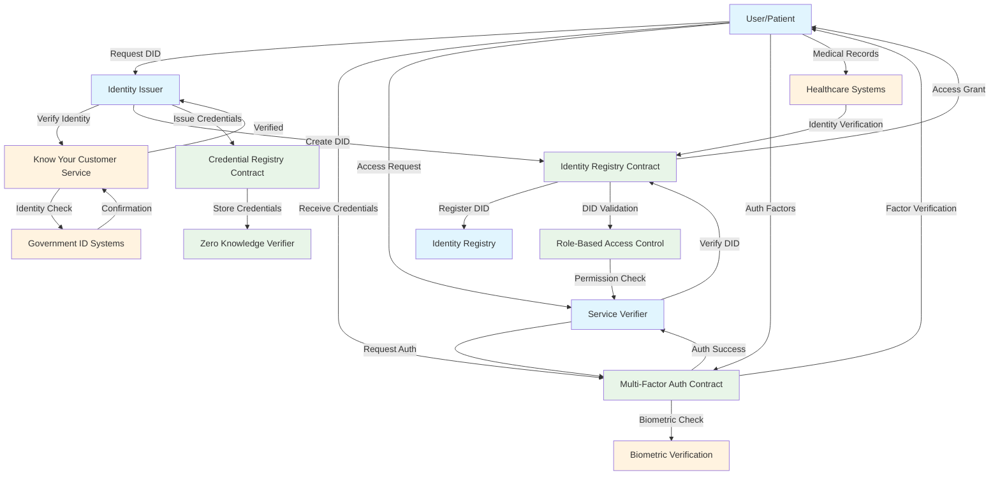
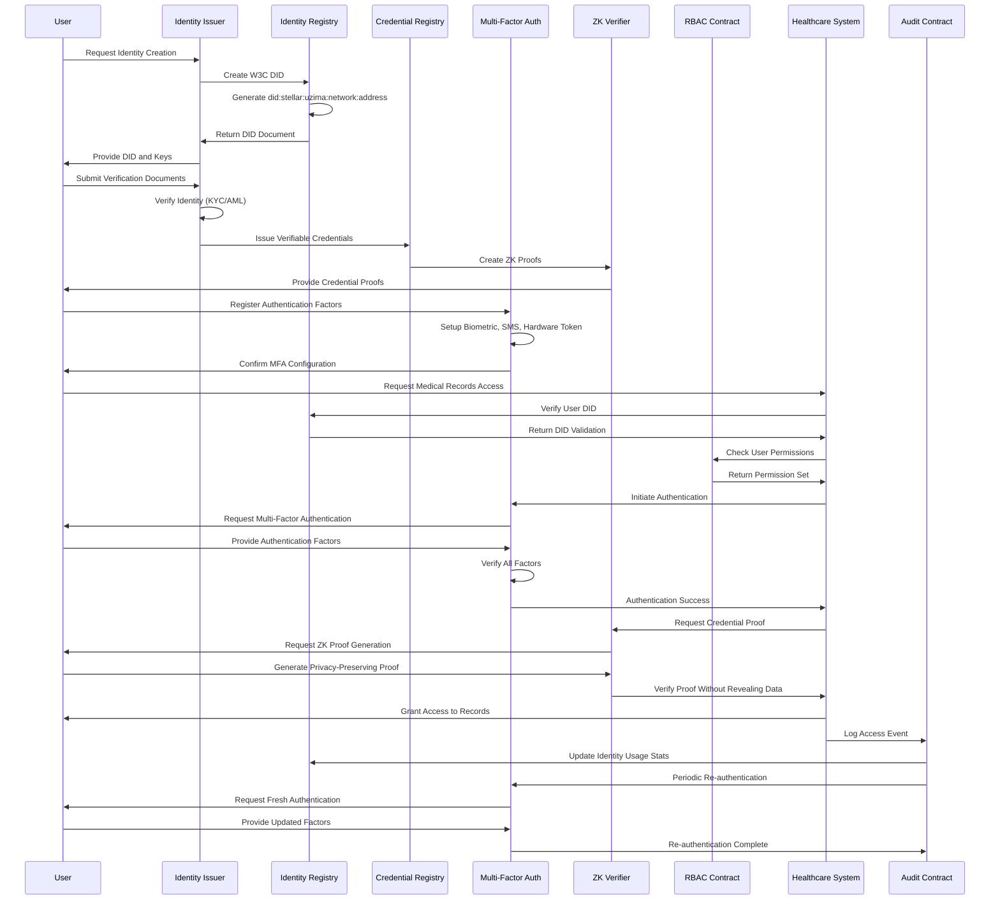
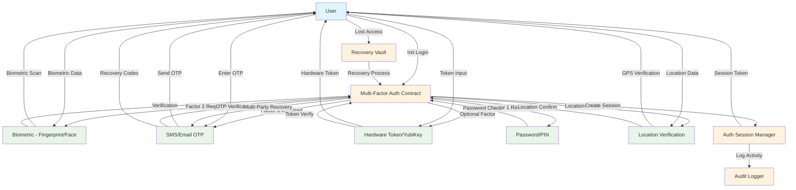
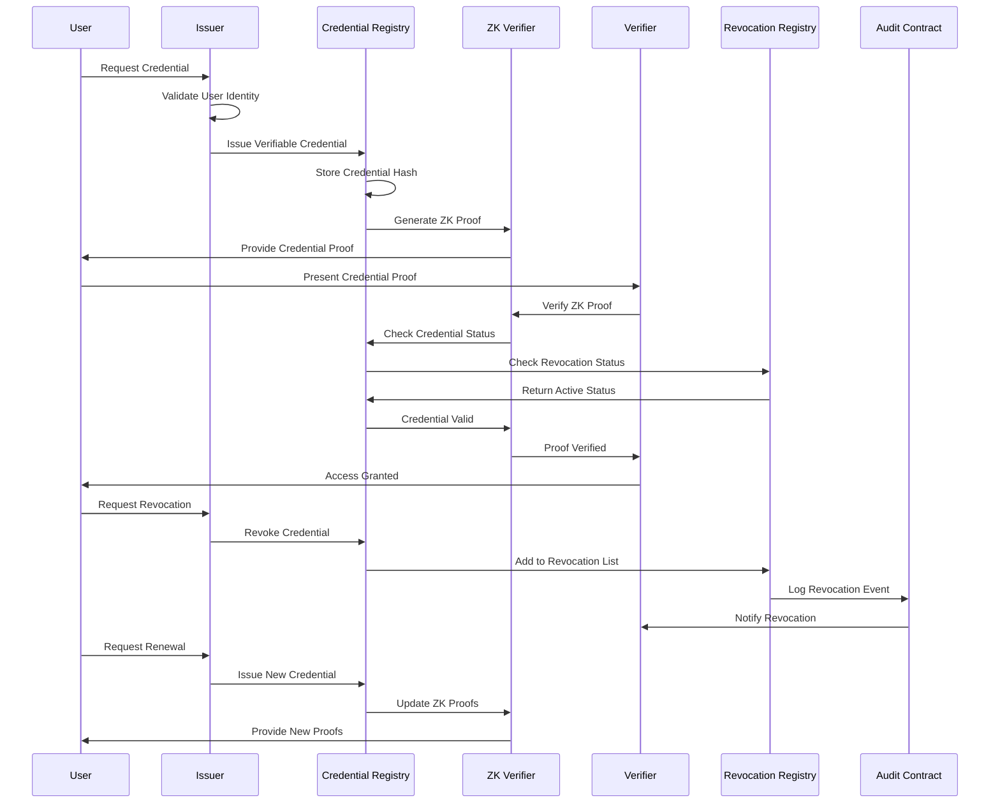
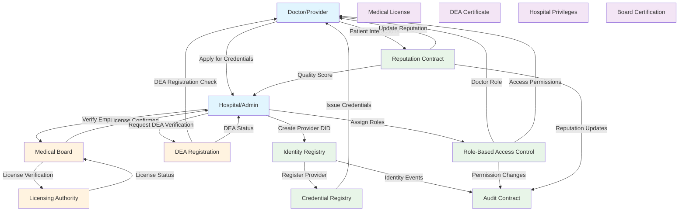
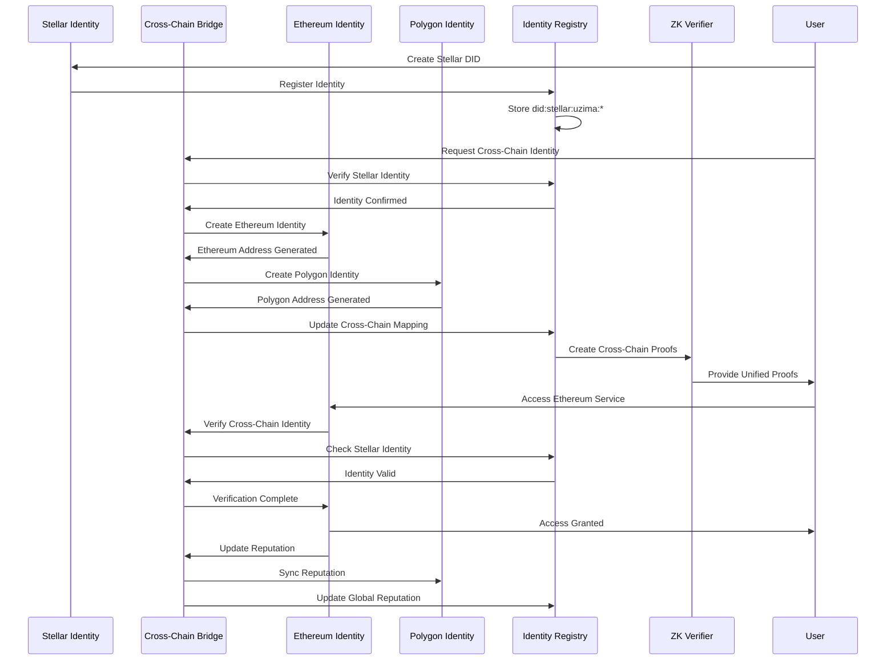
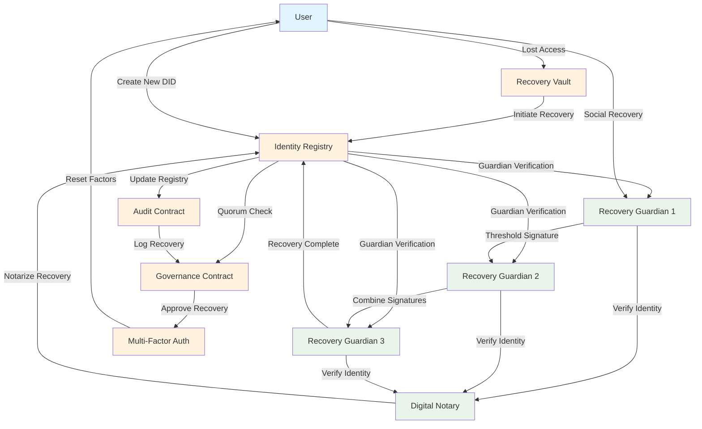
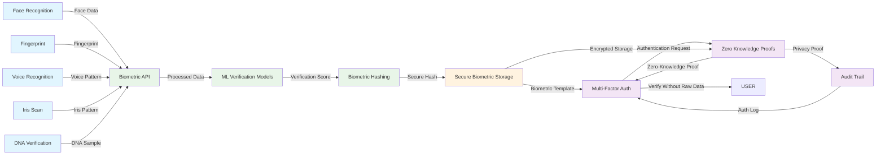

# Identity Verification Flow Diagrams

## W3C DID-Based Identity Verification Architecture

## Complete Identity Verification Sequence

## Multi-Factor Authentication Flow

## Credential Verification and Revocation Flow

## Healthcare Provider Identity Verification

## Cross-Chain Identity Verification

## Emergency Identity Recovery Flow

## Biometric Authentication Integration

## Key Identity Verification Features

### **1. W3C DID Compliance**
- **DID Method**: `did:stellar:uzima:<network>:<address>`
- **DID Documents**: Standardized identity documents
- **Verification Methods**: Multiple authentication methods
- **Service Endpoints**: Discoverable service endpoints

### **2. Multi-Factor Authentication**
- **Biometric Factors**: Fingerprint, face, voice recognition
- **Knowledge Factors**: Passwords, PINs
- **Possession Factors**: Hardware tokens, mobile devices
- **Location Factors**: Geolocation verification

### **3. Verifiable Credentials**
- **Medical Credentials**: Licenses, certifications
- **Identity Credentials**: Age, nationality verification
- **Access Credentials**: Role-based permissions
- **Revocation Support**: Dynamic credential revocation

### **4. Privacy-Preserving Verification**
- **Zero-Knowledge Proofs**: Verify without revealing data
- **Selective Disclosure**: Share only necessary information
- **Biometric Protection**: Hashed biometric templates
- **Minimal Data Collection**: Privacy-first design

### **5. Cross-Chain Identity**
- **Unified Identity**: Single identity across blockchains
- **Reputation Sync**: Cross-chain reputation transfer
- **Interoperable**: Work with multiple blockchain networks
- **Portable Identity**: Take your identity anywhere

### **6. Recovery and Backup**
- **Social Recovery**: Guardian-based recovery
- **Multi-Party Recovery**: Distributed recovery process
- **Emergency Override**: Critical access recovery
- **Secure Backup**: Encrypted identity backups

This identity verification system provides a comprehensive, secure, and privacy-preserving solution for healthcare identity management while maintaining compliance with global standards and regulations.
