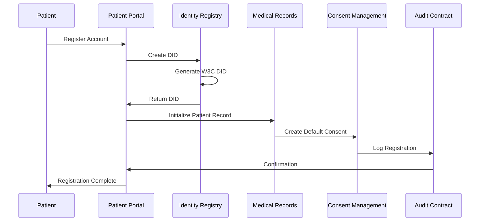
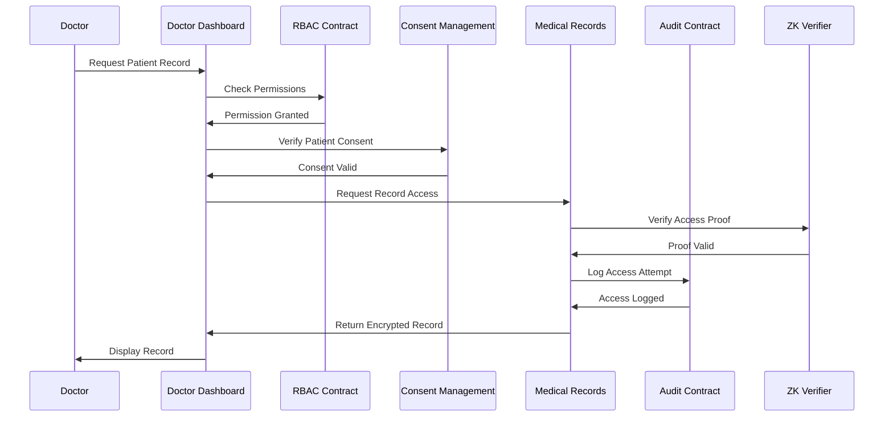
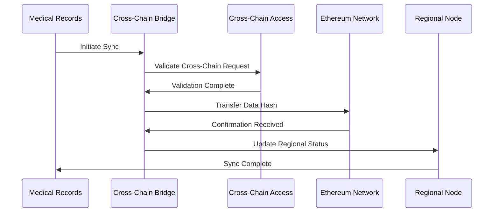
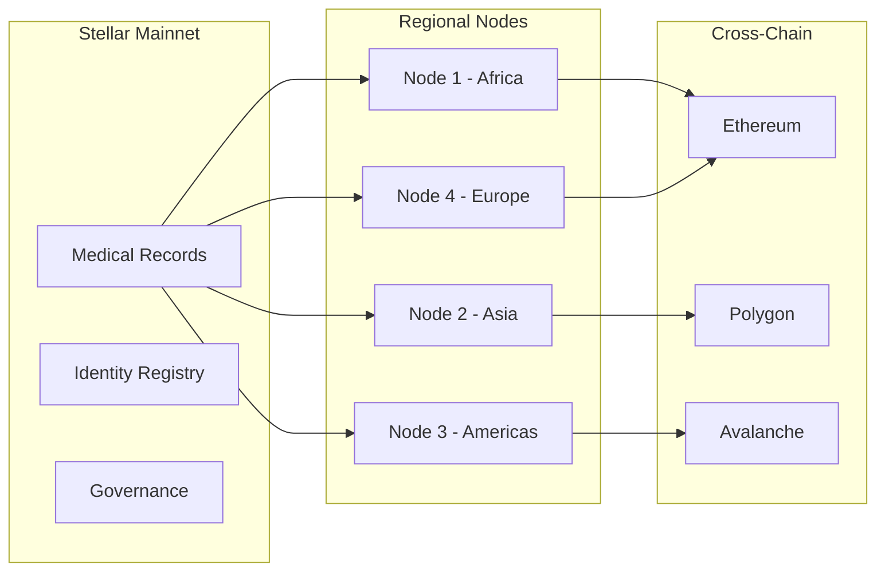

# System Architecture Overview

## High-Level Architecture Diagram

```mermaid
graph TB
    %% User Layer
    subgraph "Users & Applications"
        P[Patient]
        D[Doctor/Provider]
        A[Administrator]
        R[Researcher]
        I[Insurance Company]
    end

    %% Interface Layer
    subgraph "Interface Layer"
        PP[Patient Portal]
        DR[Doctor Dashboard]
        AA[Admin Console]
        API[REST API]
        SDK[Mobile SDK]
    end

    %% Core Contract Layer
    subgraph "Core Smart Contracts"
        MR[Medical Records Contract]
        IR[Identity Registry Contract]
        PC[Patient Consent Management]
        RB[RBAC Contract]
        AUD[Audit Contract]
    end

    %% Supporting Contracts
    subgraph "Supporting Services"
        PM[Payment Router Contract]
        ESC[Escrow Contract]
        REP[Reputation Contract]
        NOT[Notification Contract]
        CR[Credential Registry]
    end

    %% Security & Compliance
    subgraph "Security & Compliance"
        MFA[Multi-Factor Auth]
        AML[AML Detection]
        ZKP[Zero Knowledge Proofs]
        HL7[HL7/FHIR Integration]
    end

    %% Cross-Chain Layer
    subgraph "Cross-Chain Infrastructure"
        CC[Cross-Chain Bridge]
        CCA[Cross-Chain Access]
        CCI[Cross-Chain Identity]
        REG[Regional Node Manager]
    end

    %% Storage & Analytics
    subgraph "Storage & Analytics"
        IPFS[IPFS Storage]
        AI[AI Analytics]
        ML[Federated Learning]
        DS[Differential Privacy]
    end

    %% Governance
    subgraph "Governance"
        GOV[Governor Contract]
        TL[Timelock Contract]
        UM[Upgrade Manager]
    end

    %% Connections - User to Interface
    P --> PP
    D --> DR
    A --> AA
    R --> API
    I --> SDK

    %% Interface to Core Contracts
    PP --> MR
    PP --> IR
    PP --> PC
    DR --> MR
    DR --> IR
    DR --> RB
    AA --> RB
    AA --> GOV
    API --> MR
    API --> IR
    SDK --> MR
    SDK --> PC

    %% Core to Supporting
    MR --> AUD
    MR --> PM
    IR --> CR
    PC --> NOT
    RB --> MFA
    AUD --> ZKP

    %% Supporting to Security
    PM --> AML
    CR --> MFA
    RB --> ZKP
    MR --> HL7

    %% Cross-Chain Connections
    MR --> CC
    IR --> CCI
    CC --> CCA
    CCA --> REG

    %% Storage Connections
    MR --> IPFS
    AI --> ML
    ML --> DS

    %% Governance
    GOV --> TL
    TL --> UM
    UM --> MR
    UM --> IR

    %% Styling
    classDef userLayer fill:#e1f5fe
    classDef interfaceLayer fill:#f3e5f5
    classDef coreLayer fill:#e8f5e8
    classDef supportLayer fill:#fff3e0
    classDef securityLayer fill:#fce4ec
    classDef crosschainLayer fill:#f1f8e9
    classDef storageLayer fill:#e0f2f1
    classDef governanceLayer fill:#fafafa

    class P,D,A,R,I userLayer
    class PP,DR,AA,API,SDK interfaceLayer
    class MR,IR,PC,RB,AUD coreLayer
    class PM,ESC,REP,NOT,CR supportLayer
    class MFA,AML,ZKP,HL7 securityLayer
    class CC,CCA,CCI,REG crosschainLayer
    class IPFS,AI,ML,DS storageLayer
    class GOV,TL,UM governanceLayer
```

## Contract Interaction Patterns

### 1. Patient Registration Flow

### 2. Medical Record Access Flow

### 3. Cross-Chain Data Synchronization

## Key Architecture Principles

### 1. **Modular Design**
- Each contract handles a specific domain
- Clear separation of concerns
- Minimal coupling between components

### 2. **Security First**
- Zero-knowledge proofs for privacy
- Multi-factor authentication
- Role-based access control
- Comprehensive audit trails

### 3. **Interoperability**
- W3C DID compliance
- HL7/FHIR standards support
- Cross-chain compatibility
- Standardized data formats

### 4. **Scalability**
- Regional node management
- Efficient storage patterns
- Gas-optimized operations
- Layer 2 solutions support

### 5. **Governance**
- Decentralized decision making
- Time-locked upgrades
- Community voting
- Transparent processes

## Technology Stack

### **Blockchain Layer**
- **Stellar**: Primary blockchain for healthcare data
- **Soroban**: Smart contract platform
- **Rust**: Contract development language

### **Storage Layer**
- **On-Chain**: Critical metadata and access controls
- **IPFS**: Large medical files and imaging
- **Encrypted**: Patient data with patient-held keys

### **Identity Layer**
- **W3C DIDs**: Decentralized identities
- **Verifiable Credentials**: Medical certifications
- **Biometric**: Multi-factor authentication

### **Integration Layer**
- **HL7/FHIR**: Healthcare data standards
- **REST APIs**: External system integration
- **Webhooks**: Real-time notifications

### **Analytics Layer**
- **Federated Learning**: Privacy-preserving AI
- **Differential Privacy**: Statistical analysis
- **On-Chain Analytics**: Transparent metrics

## Deployment Architecture

### **Network Topology**

### **High Availability Setup**
- **Multi-region deployment** for low latency
- **Automatic failover** with disaster recovery
- **Load balancing** across regional nodes
- **Data replication** for consistency

## Security Architecture

### **Defense in Depth**
1. **Network Level**: DDoS protection, rate limiting
2. **Application Level**: Input validation, secure coding
3. **Contract Level**: Access controls, audit trails
4. **Data Level**: Encryption, zero-knowledge proofs
5. **Identity Level**: Multi-factor auth, biometric verification

### **Compliance Framework**
- **HIPAA**: US healthcare privacy
- **GDPR**: EU data protection
- **ISO 27001**: Information security management
- **HITRUST**: Healthcare cybersecurity

This architecture provides a comprehensive, secure, and scalable foundation for decentralized medical record management while maintaining compliance with global healthcare regulations.

## Excluded Contracts Audit (Issue #828)

The root `Cargo.toml` `exclude` list intentionally defers a subset of contract
crates recorded under [Issue #828](https://github.com/Stellar-Uzima/Uzima-Contracts/issues/828)
("Reintegrate 36 Excluded Contracts"). Pull request follow-ups should target
the `Fix & Include` and `Archived` categories below. Each excluded entry is
either a contract whose source predates the current `soroban-sdk = "=21.7.7"`
workspace pin, has unresolved local-path cycles, or is a non-workspace-member
directory (e.g. fuzz harness, integration test repo).

### Categorization Snapshot (last updated: fix/issue-828-reintegrate-excluded-contracts)

| Category | Contracts | Action |
| --- | --- | --- |
| **Fix & Include** (already reintegrated in this branch) | `audit`, `sync_manager`, `failover_detector` | Compile clean, tests in place |
| **Fix & Include** (reintegrated at HEAD) | `credential_notifications`, `clinical_decision_support`, `patient_portal`, `health_data_access_logging` \*, `mfa`, `rbac`, `healthcare_compliance_automation`, `drug_discovery`, `health_check` | Compile clean (\*) = moved to **Deferred** this PR; see below |
| **Deferred** (out of scope for current PR) | `health_data_access_logging` (re-deferred this PR due to 14 `#[no_std]`/SDK-21 incompatibilities: missing `format!` macro, `Vec::with_capacity` not on `soroban_sdk::Vec`, wrong `BytesN::from_array` arg shape, missing `Copy` derives), `medical_imaging`, `healthcare_compliance`, `clinical_nlp`, `remote_patient_monitoring`, `healthcare_analytics_dashboard`, `healthcare_data_marketplace`, `telemedicine`, `mental_health_support`, `patient_gamification`, `medical_imaging_ai`, `dicomweb_services`, `multi_region_orchestrator`, `regional_node_manager`, `digital_twin`, `aml`, `forensics`, `federated_learning`, `medical_records`, `healthcare_oracle_network` | Tracked in `Cargo.toml` `exclude` block with rationale; follow-up PR per contract |
| **Non-contract paths** (cannot be workspace members) | `contracts/contract_behavior_fuzzing`, `contracts/governance_integration_tests` | Continue to be excluded; they are fuzz harnesses and integration test repos |

When removing a contract from the `exclude` list, the change must:
1. Pin `soroban-sdk = { workspace = true }` (no literal versions) so all crates
   resolve to a single consistent SDK version.
2. Verify `#![no_std]` (no `format!`, no `String::to_string()`, no `.as_bytes()`
   on std `String`). Hash inputs must be assembled via `soroban_sdk::Bytes::append`
   and `append_array` rather than `Vec::<u8>::with_capacity`.
3. Provide at minimum three tests: an `initialize()` test, a happy-path test,
   and an error-path test (e.g. `expect_*Auth` failure).

